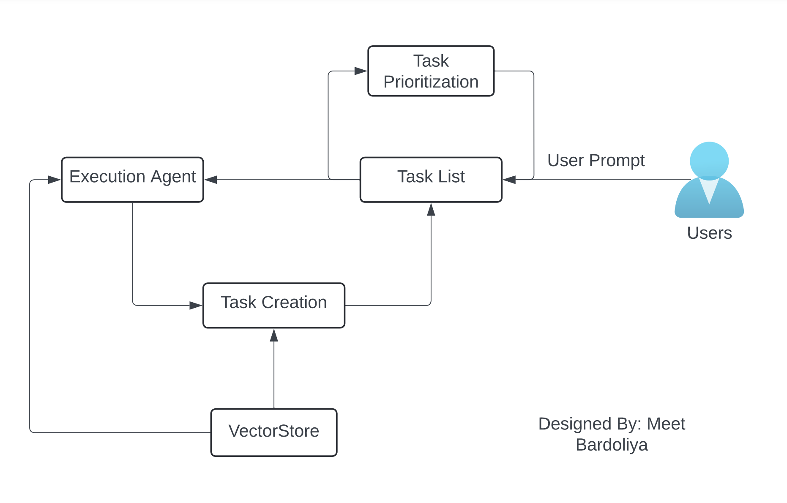

# AGI-Application
This repository conaints custom AGI Applicatioon called QueupAGI

Model Workflow

User prompt first goes to task list and execution agent execute the task which stores result into vectorStore as well as this result is helpful to use as context of for the next task generation
For the task generation we are using result to last task as a context and our main objective which is user prompt. Generated task added into task list.
Task list is getting prioritized using task prioritization chain. 

Define the Chains

Our AGI Model relies on three LLM Chains:

1. Task creation chain to select new task and add it into task list
2. Task prioritization chain to re-prioritize tasks
3. Execution chain to execute the tasks

Note: Execution chain is nothing but our agent

Here, for our agent we have just used google search api, which is provided by langchain tools as SerpAPI, we can add more tools into our tool list as per the requirements, where our Agent can search the information which is required. 

Vectorstore: Vectorstore stores the information using OpenAIEmbeddings and Indexing method so that retrive time for data retrival can be minimum. 

For the interactive application, Steps that we can implement in future:
We can create our own corpus of actions such as "open this app", "open first link", "open link with blue logo" and so on
once we have all the general purpose action words as a corpus of data. We can store them into vectorstore using embeddings.
Now while executing agent, we can call most similar matched action based on cosine similarity or angular distance.
perform that specific action using selenium webdrive (This code can be written as python module in backend)
Using this workflow we can redirect user onto specific location based on our task list.

Result: 

Result of the Model can be seen inside the agent.ipynb notebook.

Thank you
